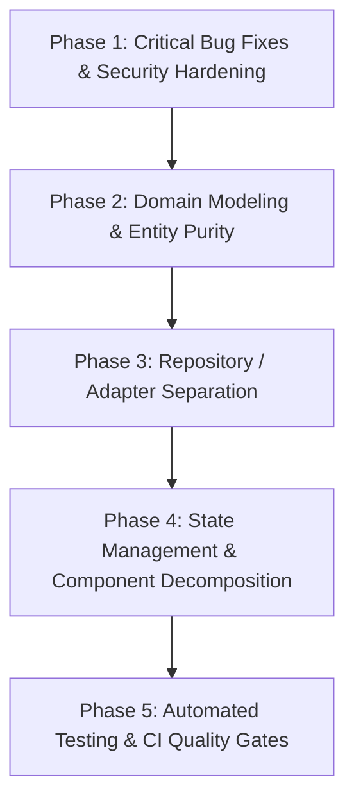

# InkLink Architecture Analysis & Remediation Plan

**Analysis Date:** September 2026  
**Frameworks & Methodologies:** Clean Architecture (Uncle Bob), Hexagonal Architecture (Ports & Adapters), Domain-Driven Design (DDD) Tactical & Strategic Patterns.

---

## Executive Summary

InkLink is a real-time collaborative canvas application featuring Flutter (Client), Firebase Cloud Functions & Cloudflare R2 (Backend API & Storage), Node.js / Socket.io / Redis / Yjs (Real-time CRDT WebSocket Relay), and Cloud Firestore / Realtime Database (Persistence & Presence).

While the application features a functional feature-sliced layout and architecture guardrail scripts (`tool/architecture_guardrails.dart`), a deep architectural audit against **Clean Architecture**, **Hexagonal Architecture**, and **Domain-Driven Design (DDD)** reveals critical design anti-patterns, framework coupling, layer boundary leaks, domain anemia, security holes, and lifecycle bugs.

This document categorizes all discovered problems and provides an incremental, phased remediation plan to refactor InkLink into a production-grade, highly testable, and resilient architecture.

---

## Part 1: Discovered Architecture Problems & Bugs

### Category A: Clean Architecture Violations (Framework & Infrastructure Leaks)

1. **Domain Entities Polluted with Infrastructure Annotations & Vendor SDKs**
   - **File:** `lib/domain/models/user_model.dart`
     - Uses `@collection`, `@Index`, `Id? id` from `package:isar_community/isar.dart` (ORM database coupling).
     - Exposes Firestore serialization methods (`fromFirestore`, `toFirestore`).
     - Contains mutable `late` fields instead of immutable value definitions.
   - **File:** `lib/domain/models/board.dart`
     - Imports `package:cloud_firestore/cloud_firestore.dart` and uses `Timestamp` directly inside domain models.
   - **File:** `lib/domain/repositories/canvas/canvas_sync_repository.dart` & `lib/domain/services/canvas/canvas_service.dart`
     - Uses `LocalCrdtUpdate` (an Isar `@collection` class from `lib/core/database/collections/local_crdt_update.dart`) across repository interfaces and domain services.
   - **File:** `lib/domain/services/auth/auth_session_service.dart`
     - Directly imports `package:firebase_auth/firebase_auth.dart` and uses vendor SDK class `User?` in public domain service signatures.
   - **Clean Architecture Rule:** *Entities and Domain Models must be pure Dart objects with zero framework, SDK, or ORM imports.*

2. **Inverted Dependency Flow in Presentation Models**
   - **File:** `lib/features/canvas/models/canvas_element.dart`
     - Imports `package:flutter/material.dart` (`Offset`, `Color`).
     - Imports `../view/trays/canvas_shape_type.dart` — a **model file importing from a UI view folder**.
   - **Clean Architecture Rule:** *Views depend on models; models must never import or depend on views.*

3. **Repository Implementations (`*_impl.dart`) Placed Directly in Domain Layer**
   - **Directory:** `lib/domain/repositories/`
     - Contains concrete implementation classes (`FirestoreBoardRepository`, `FriendsRepositoryImpl`, `FirebaseAuthRepository`, etc.) alongside abstract interfaces.
     - Concrete implementations import Firestore, Isar, Realtime Database, and SharedPreferences.
   - **Clean Architecture Rule:** *The `domain/` layer contains only Ports (abstract interfaces) and Entities. Concrete Adapters belong in `data/` or `infrastructure/`.*

4. **Abstraction Leakage via `.getInstance()`**
   - **Files:** `lib/core/services/firestore_service.dart`, `lib/core/services/auth_service.dart`
     - Expose `.getInstance()` which returns raw `FirebaseFirestore` and `FirebaseAuth` instances.
     - Repositories (e.g., `workspace_repository_impl.dart`, `board_repository_impl.dart`, `auth_repository_impl.dart`) bypass abstraction boundaries by calling `_firestoreService.getInstance()`, defeating mocking and unit testability.

---

### Category B: Domain-Driven Design (DDD) & Strategic Modeling Deficiencies

1. **"Maply-Typed" Anemic Domain (Primitive Obsession & Absent Entities)**
   - Almost all inter-service communications pass raw `Map<String, dynamic>`:
     - `FriendsService`: `FriendsInfoSnapshot` holds `List<Map<String, dynamic>> friends`. No `Friend`, `FriendRequest`, or `BlockedUser` entity exists.
     - `InvitationService`: `watchPendingInvites()` returns `List<Map<String, dynamic>>`. No `BoardInvitation` entity exists.
     - `NotificationService`: `watchNotifications()` returns `List<Map<String, dynamic>>`. No `InAppNotification` entity exists.
     - `ProfileService`: `ProfileViewData.userData` is an untyped `Map<String, dynamic>`.
   - **Consequence:** Compile-time type checking is lost. UI widgets must write fragile manual parsing:
     ```dart
     // board_invites_screen.dart
     final boardTitle = invite['boardTitle']?.toString() ?? 'Untitled Board';
     final senderName = invite['senderName']?.toString() ?? 'InkLink User';
     ```
     Any backend rename or type change results in silent nulls or runtime crashes undetected by `flutter analyze`.

2. **Cross-Context Bleed & Missing Anti-Corruption Layers (ACL)**
   - `ProfileServiceImpl` directly injects `FriendsRepository` across context boundaries.
   - `InvitationServiceImpl` directly injects `BoardRepository`.
   - `AuthSessionServiceImpl` directly injects infrastructure services (`LocalDatabaseService`, `CanvasSyncRepository`, `MessagingService`).
   - Context boundaries are porous rather than communicating via domain events, application use cases, or explicit Anti-Corruption Layers.

3. **Backend Bounded Context Mismatch**
   - In `functions/src/`, `send_board_invite.js` is placed inside `src/notifications/` rather than `src/invitations/` or `src/boards/`.

---

### Category C: God Objects & Component Bloat

1. **Monolithic Canvas Screen & BLoC**
   - **File:** `lib/features/canvas/view/canvas_screen.dart` — **2,456 lines**
     - Contains gesture handling, viewport transforms, shape drawing, brush picking, dialogs, media management, image placement, keyboard navigation, and tray rendering.
   - **File:** `lib/features/canvas/bloc/canvas_bloc.dart` — **1,737 lines**
     - Manages ~40 disparate event types: canvas strokes, shape creation, resizing, rotating, text generation, image updates, brush settings, tray UI toggles, undo/redo stacks, and CRDT synchronization.
   - **File:** `lib/features/canvas/view/canvas_painter.dart`
     - Re-declares its own private `_CanvasElement` and `_ElementKind` duplicate enum, diverging from `CanvasElement` (e.g. Missing `ImageElement` in `_ElementKind`).

---

### Category D: Concrete Logic, Security & Runtime Bugs

1. **Startup Crash Risk via Force-Unwrapped `.env` Variable**
   - **File:** `lib/main.dart` (Lines 67–70)
     ```dart
     final rtdb = FirebaseDatabase.instanceFor(
       app: Firebase.app(),
       databaseURL: dotenv.env['FIREBASE_RTDB_URL']!,
     );
     ```
     If `.env` is absent, unread, or missing `FIREBASE_RTDB_URL`, the application crashes on startup with an unhandled Null Check Operator error.

2. **WebSocket Relay Security Hole (Missing Board Authorization)**
   - **File:** `server/src/index.js` (Lines 394–403, 419–550)
     - `watch_board` joins any socket to `board_room:${boardId}` without validating whether `socket.data.uid` has read access to `boardId`.
     - `crdt_update` broadcasts updates and writes to Redis/Firestore without checking whether `socket.data.uid` is an active editor or owner.
     - Any authenticated user can eavesdrop on private boards or inject arbitrary CRDT mutations.

3. **Missing Socket Disconnect on Member Removal**
   - **File:** `functions/src/boards/remove_board_member.js`
     - When an owner removes a member, Firestore permissions and Redis member lists are updated, but the active WebSocket connection is never notified or kicked from `board_room:${boardId}`.

4. **Incomplete Cascading Deletion & Orphaned Documents**
   - **File:** `functions/src/boards/delete_board.js`
     - Firestore does not delete subcollections automatically. Subcollections `boards/{boardId}/members`, `boards/{boardId}/snapshot`, and legacy `operations` remain orphaned.
     - The owner's board index document (`users/{uid}/boards/{boardId}`) is **not deleted** (only member indices are deleted).
     - Redis streams (`board_updates:{boardId}`) and version counters are not cleared.

5. **Firestore Security Rule Mismatch on Blocked Users**
   - **File:** `firestore.rules` (Lines 133–138)
     ```javascript
     match /blocked_users/{blockId} {
       allow get: if signedIn() && blockId.matches('^' + request.auth.uid + '_.*$');
       allow list: if false;
       allow write: if false;
     }
     ```
     Because `allow list: if false;`, the client cannot list blocked users from Firestore. The client solely watches local Isar (`watchBlockedUsers()`). Upon reinstallation or logging in on a new device, blocked users cannot be synchronized.

6. **Lifecycle Logout Leak & UI Guardrail Bypass**
   - **File:** `lib/features/settings/view/settings_screen.dart` (Lines 208–213)
     - Directly calls `friendsBloc.stopForLogout()`, `dashboardBloc.stopForLogout()`, etc.
     - Tricked the guardrail regex by aliasing context reads to local variables.
     - If logout occurs outside `SettingsScreen` (e.g., token expiration, background session revoked), none of these streams are torn down, causing `FirebaseException (permission-denied)` errors and memory leaks.

7. **UI Flashing on Dashboard Load**
   - **File:** `lib/features/dashboard/bloc/dashboard_bloc.dart` (Lines 184–189)
     - Emits `ownedBoards: const [], joinedBoards: const []` on every `LoadDashboardRequested`, wiping existing boards from screen before the stream emits, causing noticeable flicker.

8. **Missing Error Hierarchy (Leaking Raw Exceptions to UI)**
   - Errors from Firebase, Platform channels, and Sockets bubble directly to UI Snackbars via `_humanizeError(e)`, displaying raw strings like `[cloud_firestore/permission-denied]` to end users.

9. **Zero Automated Backend Tests**
   - `functions/`: 0 unit/integration tests.
   - `server/`: 0 unit/integration tests.
   - Client domain services: 0 unit tests.

---

## Part 2: Target Architecture Design

### Layered Structure (Clean / Hexagonal)

```text
lib/
|-- core/                        <-- Truly cross-cutting primitives only (no business logic)
|   |-- constants/
|   |-- errors/                  <-- Core exceptions, Failure types
|   |-- theme/
|   `-- utils/
|
|-- domain/                      <-- PURE DART (Zero Flutter UI, Zero Firebase SDK, Zero Isar)
|   |-- failures/                <-- Failure sealed class hierarchy (AuthFailure, BoardFailure...)
|   |-- models/                  <-- Pure domain entities and value objects
|   |   |-- auth/                <-- AuthUser, UserSession
|   |   |-- board/               <-- Board, BoardMember, BoardRole, BoardVisibility
|   |   |-- canvas/              <-- CanvasElement, Stroke, Shape, CanvasToolMode, CrdtUpdate
|   |   |-- friends/             <-- Friend, FriendRequest, BlockedUser
|   |   |-- invitation/          <-- BoardInvitation, InvitationStatus
|   |   |-- notification/        <-- InAppNotification, NotificationType
|   |   |-- profile/             <-- UserProfile
|   |   `-- workspace/           <-- Workspace, WorkspaceMember, WorkspaceInvite
|   |-- repositories/            <-- Abstract Port Interfaces ONLY (No *_impl.dart here!)
|   `-- use_cases/               <-- Explicit application use cases (Single Responsibility)
|
|-- data/ (or infrastructure/)   <-- Concrete Adapters (Firebase, Isar, Socket, SharedPreferences)
|   |-- datasources/             <-- Remote & Local data sources
|   |   |-- remote/              <-- Firestore, CloudFunctions, WebSocket, RTDB
|   |   `-- local/               <-- Isar database collections, SharedPreferences
|   |-- mappers/                 <-- Maps (DTO / ORM <-> Pure Domain Entity)
|   `-- repositories/            <-- Repository Implementations (BoardRepositoryImpl, etc.)
|
`-- features/ (Presentation)     <-- UI Layer (Flutter, BLoC, Widgets)
    |-- auth/
    |-- canvas/
    |   |-- bloc/                <-- Decomposed BLoCs (ToolBloc, CanvasCrdtBloc, CanvasObjectBloc)
    |   `-- view/                <-- Decomposed sub-widgets (< 400 lines each)
    |-- dashboard/
    `-- ...
```

---

## Part 3: Step-by-Step Remediation Plan



### Phase 1: Critical Bug Fixes & Security Hardening (Immediate Priority)

- [ ] **1.1 Fix `.env` Startup Crash in `lib/main.dart`**
  - Add null validation and fallback for `dotenv.env['FIREBASE_RTDB_URL']`.
  - Provide descriptive startup error screen if required configurations are missing instead of crashing with unhandled exception.
- [ ] **1.2 Enforce Authorization on WebSocket Relay (`server/src/index.js`)**
  - Verify board membership against Firestore/Redis before permitting `socket.join('board_room:${boardId}')`.
  - On `crdt_update`, verify that `socket.data.uid` has `owner` or `editor` role on `boardId`.
  - Reject unauthorized joins/updates with `{ status: 'error', code: 'forbidden' }`.
- [ ] **1.3 Add Socket Room Eviction on Member Removal**
  - In `functions/src/boards/remove_board_member.js`, publish a Redis eviction event (`board_member_removed`) that triggers the WebSocket server to disconnect/leave the member socket from `board_room:${boardId}`.
- [ ] **1.4 Complete Cascading Cleanup on Board Deletion**
  - In `functions/src/boards/delete_board.js`:
    - Delete the owner's index: `users/{uid}/boards/{boardId}`.
    - Delete subcollections: `boards/{boardId}/members`, `boards/{boardId}/snapshot`, `boards/{boardId}/operations`.
    - Clear Redis stream and state: `board_updates:{boardId}`, `board:{boardId}:version`, `board:dedup:{boardId}`.
- [ ] **1.5 Fix `firestore.rules` for Blocked Users Sync**
  - Update `match /blocked_users/{blockId}` in `firestore.rules` to allow `list` queries where `request.auth.uid == resource.data.blockerUid`.
  - Enable two-way synchronization between Firestore and local Isar database.
- [ ] **1.6 Unify App Logout Teardown**
  - Remove imperative `stopForLogout()` calls from `SettingsScreen`.
  - Make `AuthBloc` emit an `Unauthenticated` state which causes `AppView` to tear down feature providers or dispatch a centralized `AppResetRequested` event across all active BLoCs.

---

### Phase 2: Pure Domain Modeling & Eliminating "Maply-Typed" Code

- [ ] **2.1 Decouple Entities from Frameworks**
  - Remove `@collection`, `@Index`, `Id? id`, and Firestore serialization from `UserModel`. Create a separate `LocalProfile` Isar collection and a Firestore DTO with a mapper.
  - Remove `Timestamp` from `Board` model and use standard Dart `DateTime`. Move Firestore timestamp mapping into repository mappers.
  - Remove Flutter UI imports (`Offset`, `Color`) and view tray imports from `CanvasElement`. Move `CanvasShapeType` into `domain/models/canvas/`.
- [ ] **2.2 Create Strong Domain Entities for Untyped Contexts**
  - Create `Friend`, `FriendRequest`, and `BlockedUser` domain entities in `domain/models/friends/`.
  - Create `BoardInvitation` entity in `domain/models/invitation/`.
  - Create `InAppNotification` entity in `domain/models/notification/`.
  - Update `FriendsService`, `InvitationService`, and `NotificationService` to return typed entities instead of `Map<String, dynamic>`.
- [ ] **2.3 Create Domain Failure Hierarchy**
  - Create `sealed class Failure` (`AuthFailure`, `NetworkFailure`, `BoardNotFoundFailure`, `PermissionDeniedFailure`, `ValidationFailure`).
  - Return typed failures or map infrastructure exceptions in repositories so BLoCs receive strongly typed domain failures.

---

### Phase 3: Layer Decoupling & Hexagonal Ports/Adapters

- [ ] **3.1 Move Repository Implementations to `data/` or `infrastructure/`**
  - Relocate all `*_impl.dart` files from `lib/domain/repositories/` to `lib/data/repositories/`.
  - Keep only pure abstract contracts in `lib/domain/repositories/`.
- [ ] **3.2 Eliminate Leaky `.getInstance()` in Infrastructure Services**
  - Remove `getInstance()` from `FirestoreService` and `AuthService`.
  - Implement full abstraction methods (e.g. `runTransaction`, `batch`, `authStateChanges`) within the wrappers, eliminating any direct SDK leaking.
- [ ] **3.3 Decouple Canvas CRDT from Database ORM Collection**
  - Create a pure domain entity `CrdtUpdate` in `domain/models/canvas/`.
  - Keep `LocalCrdtUpdate` strictly as an internal Isar collection within `data/datasources/local/`.
  - Map between `LocalCrdtUpdate` and `CrdtUpdate` in `CanvasSyncRepositoryImpl`.
- [ ] **3.4 Resolve Bounded Context Cross-Dependencies (ACLs)**
  - Refactor `ProfileServiceImpl` so it does not directly inject `FriendsRepository`. Use `FriendsService` or a focused query interface.
  - Refactor `InvitationServiceImpl` to consume `BoardService` rather than `BoardRepository`.
  - Move `functions/src/notifications/send_board_invite.js` to `functions/src/invitations/send_board_invite.js`.

---

### Phase 4: Component & BLoC Decomposition

- [ ] **4.1 Decompose `CanvasBloc` (1,737 lines)**
  - Split into three focused BLoCs:
    1. `CanvasToolBloc`: Manages active tool, color, stroke width, opacity, tray visibility.
    2. `CanvasCrdtBloc`: Manages Yjs document, remote updates, socket connection state, undo/redo.
    3. `CanvasElementBloc`: Manages selected elements, transformations (move/scale/rotate), in-memory element list.
- [ ] **4.2 Decompose `CanvasScreen` (2,456 lines)**
  - Extract dedicated sub-widgets:
    - `CanvasGestureSurface` (stroke input, pinch/pan viewport management).
    - `CanvasSelectionOverlay` (handles, bounding box, rotation pivot).
    - `CanvasToolbar` / `CanvasTrayContainer`.
  - Keep `canvas_screen.dart` under 400 lines acting solely as a layout coordinator.
- [ ] **4.3 Unify Element Hierarchy in `CanvasPainter`**
  - Delete duplicate `_CanvasElement` class in `canvas_painter.dart`.
  - Use the sealed `CanvasElement` hierarchy directly for rendering all element types, including `ImageElement`.
- [ ] **4.4 Fix Dashboard State Flashing**
  - Update `DashboardLoaded` in `dashboard_bloc.dart` to retain existing `ownedBoards` and `joinedBoards` during refresh operations instead of emitting empty lists.

---

### Phase 5: Automated Testing & Verification Gates

- [ ] **5.1 In-Memory Repository Adapters for Unit Tests**
  - Implement `InMemoryBoardRepository`, `InMemoryAuthRepository`, and `InMemoryFriendsRepository`.
  - Write domain service and use-case unit tests without Firebase or Isar dependencies (following Clean Architecture test standards).
- [ ] **5.2 Backend Cloud Functions Tests**
  - Add Mocha/Jest test suite in `functions/` using `firebase-functions-test` to cover board creation, deletion, invitations, and role management.
- [ ] **5.3 WebSocket Relay Integration Tests**
  - Add automated Socket.io client tests in `server/` to verify rate-limiting, authentication rejection, and room membership enforcement.
- [ ] **5.4 Update Architecture Guardrails Script**
  - Enhance `tool/architecture_guardrails.dart` to detect:
    - Calls to `.getInstance()` outside allowed wrappers.
    - Repository `*_impl.dart` files placed inside `lib/domain/`.
    - Domain models importing Flutter Material or Isar.
    - Screens directly aliasing and calling BLoC methods.

---

## Part 4: Verification & Success Metrics

| Metric | Current State | Target State |
| :--- | :--- | :--- |
| **Domain Purity** | Polluted with Isar, Firestore, Flutter UI | 100% Pure Dart domain entities |
| **Type Safety** | 4 key features use `Map<String, dynamic>` | Fully typed domain entities & failures |
| **File Size Health** | 2 files > 1,700 lines (`canvas_screen`, `canvas_bloc`) | All files < 500 lines |
| **WebSocket Security** | Open room joining & unverified CRDT writes | Full auth + board role authorization |
| **Automated Test Coverage** | Only Canvas BLoC & Isar models tested | Domain services, Cloud Functions, & Relay tested |
| **Architecture Guardrails** | Bypassed via local variable aliasing | Enforced strictly across all layers |
