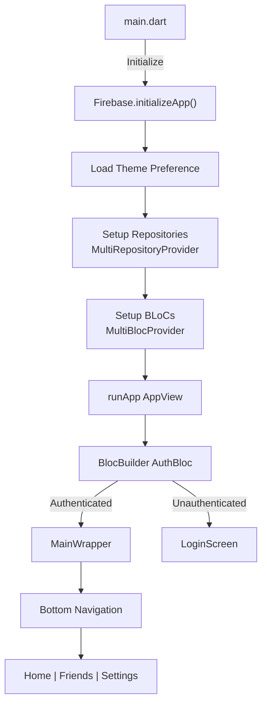
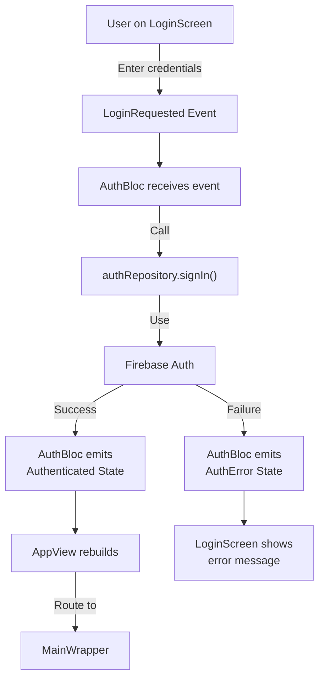
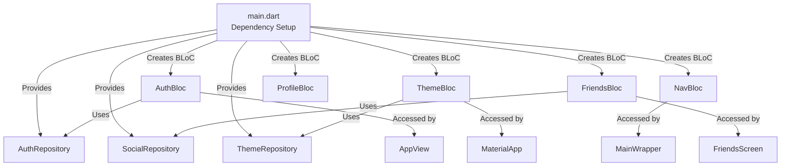
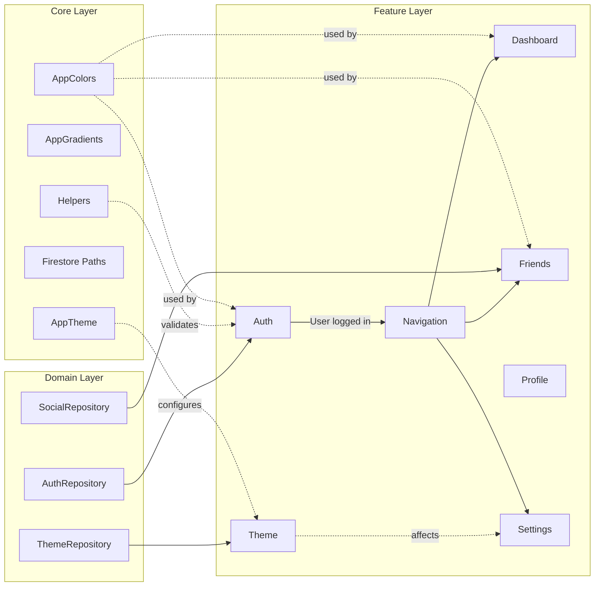
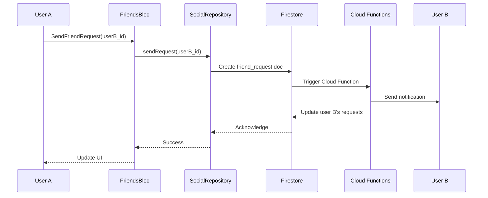
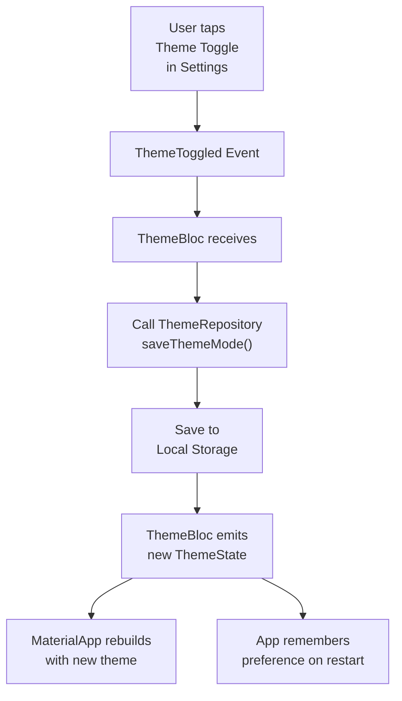

# InkLink - Lib Folder Architecture

This document provides a comprehensive guide to the `lib` folder structure, explaining what each file/folder does, how they work together, and their dependencies.

---

## 📁 Folder Structure Overview

```
lib/
├── main.dart                    # App entry point
├── app_view.dart               # Root widget with auth routing
├── firebase_options.dart       # Firebase platform configuration
├── core/                       # Shared utilities & constants
│   ├── constants/              # App-wide constants
│   ├── theme/                  # Theming configuration
│   └── utils/                  # Helper functions
├── domain/                     # Business logic & contracts
│   └── repositories/           # Interface definitions & implementations
└── features/                   # Feature modules (feature-driven architecture)
    ├── auth/                   # Authentication feature
    ├── dashboard/              # Home/Dashboard feature
    ├── friends/                # Friends management feature
    ├── navigation/             # App-wide navigation
    ├── profile/                # User profile feature
    ├── settings/               # App settings feature
    └── theme/                  # Theme management feature
```

---

## 🎯 Core Files Explained

### 1. **main.dart** - Application Entry Point
**Purpose**: Initializes the app and sets up the dependency injection layer.

**Key Responsibilities**:
- Initializes Flutter bindings
- Configures Firebase with platform-specific options
- Loads the initial theme mode from persistence
- Sets up all repositories (dependency providers)
- Sets up all BLoCs (state managers)
- Handles theme synchronization at startup

**Dependencies**:
- `firebase_core` - Firebase initialization
- `flutter_bloc` - State management
- All repositories and BLoCs

**Code Flow**:
```
main() 
  → Firebase.initializeApp()
  → Load theme preference
  → Setup Repositories (MultiRepositoryProvider)
  → Setup BLoCs (MultiBlocProvider)
  → runApp(AppView)
```

---

### 2. **app_view.dart** - App Root Widget
**Purpose**: The root widget that handles authentication state and routing.

**Key Responsibilities**:
- Listens to `AuthBloc` for authentication state changes
- Routes users to appropriate screens:
  - `LoginScreen` if unauthenticated
  - `MainWrapper` if authenticated
  - Splash/Loading screen while checking authentication

**Architecture**:
```dart
AppView
  └── BlocBuilder<AuthBloc>
      ├── Authenticated → MainWrapper (main app)
      └── Unauthenticated/AuthError/AuthLoading → LoginScreen
```

**Dependencies**:
- `AuthBloc` - Authentication state
- `LoginScreen` - Unauthenticated UI
- `MainWrapper` - Authenticated UI (main app)

---

### 3. **firebase_options.dart** - Firebase Configuration
**Purpose**: Stores platform-specific Firebase initialization options (auto-generated file).

**Key Responsibilities**:
- Provides Firebase configuration for Android, iOS, Web, macOS, Windows
- Uses `DefaultTargetPlatform` and `kIsWeb` to select correct config
- Auto-generated by FlutterFire CLI (do not edit manually)

**Usage**:
```dart
// In main.dart
await Firebase.initializeApp(
  options: DefaultFirebaseOptions.currentPlatform
);
```

---

## 🛠️ Core Folder - Utilities & Constants

### **core/constants/app_colors.dart**
**Purpose**: Centralized color definitions for the entire app.

**Provides**:
- Brand colors (primary, accent)
- Light theme colors (background, surface, text)
- Dark theme colors
- Action-specific colors (blue, orange, etc.)

**Usage**:
```dart
// Used throughout the app for consistency
Container(
  color: AppColors.primary,
  child: Text('Hello', style: TextStyle(color: AppColors.textPrimaryLight)),
)
```

---

### **core/constants/app_gradients.dart**
**Purpose**: Predefined gradient definitions (referenced in multiple UI components).

---

### **core/constants/firestore_paths.dart**
**Purpose**: Constants for Firestore collection and document paths.

**Benefits**:
- Centralized path management
- Reduces typos in database queries
- Easy refactoring of collection structure

---

### **core/theme/app_theme.dart**
**Purpose**: Defines light and dark Material 3 themes.

**Provides**:
- `ThemeData` configurations for light mode
- `ThemeData` configurations for dark mode
- Consistent styling across Material components:
  - AppBar styling
  - Input field styling
  - Color schemes
  - Typography

**Dependencies**:
- `AppColors` - Uses color constants

**Usage**:
```dart
// In main.dart MaterialApp
MaterialApp(
  theme: AppTheme.lightTheme,
  darkTheme: AppTheme.darkTheme,
  themeMode: /* from ThemeBloc */,
)
```

---

### **core/utils/helpers.dart**
**Purpose**: Reusable utility functions across the app.

**Current Functions**:
- `generateSearchKeywords(String name)` - Creates search keywords for Firestore full-text search
- `isValidEmail(String email)` - Email validation with regex
- `isValidPassword(String password)` - Password strength validation

**Dependency Chain**: Used by auth features and friend search.

---

## 🏗️ Domain Folder - Business Logic & Contracts

### **domain/repositories/**
**Purpose**: Defines abstract interfaces and implementations for data operations.

**Pattern**: Repository pattern provides abstraction layer between UI and data sources.

#### **auth_repository.dart** (Interface)
**Defines the contract for authentication**:
- `signIn()` - Email/password login
- `signUp()` - User registration
- `signInWithGoogle()` - OAuth login
- `signOut()` - Logout
- `registerUserInFirestore()` - Create user profile in Firestore
- `user` Stream - Real-time auth state
- `currentUser` getter - Current user snapshot

```dart
abstract class AuthRepository {
  Future<User?> signIn(String email, String password);
  Future<User?> signUp(String name, String email, String password);
  Future<User?> signInWithGoogle();
  Future<void> signOut();
  Stream<User?> get user;
  User? get currentUser;
  Future<void> registerUserInFirestore(User user, {String? displayName});
}
```

#### **auth_repository_impl.dart** (Implementation)
**Implementation using Firebase Auth**:
- Uses Firebase Authentication SDK
- Manages real-time user streams
- Handles Firestore user document creation

**Dependency**: Firebase Authentication, Firestore

---

#### **social_repository.dart** & **social_repository_impl.dart**
**Purpose**: Manages friend requests, friendships, and social features.

**Key Operations**:
- Send friend requests
- Accept/decline friend requests
- Fetch friends list
- Manage social connections

**Dependency**: Firestore (database), Cloud Functions (backend logic)

---

#### **theme_repository.dart**
**Purpose**: Persists and retrieves user theme preferences.

**Operations**:
- Save theme mode to local storage
- Load theme mode from storage
- Provide theme mode to app

**Dependency**: Shared preferences/local storage

---

## ⚛️ Features Folder - Feature-Driven Architecture

The app uses a **feature-driven architecture** where each feature is self-contained with its own:
- BLoCs (state management)
- Views (UI screens)
- Widgets (reusable UI components)

### **features/auth/** - Authentication Feature

#### Files:
- `bloc/auth_bloc.dart` - Manages auth state and events
- `bloc/auth_event.dart` - Auth-related events
- `bloc/auth_state.dart` - Auth states (Initial, Loading, Authenticated, Unauthenticated, Error)
- `view/login_screen.dart` - Login/Register combined UI
- `view/register_screen.dart` - Registration screen
- `widgets/auth_text_field.dart` - Custom input field for auth forms
- `widgets/social_auth_button.dart` - Google sign-in button

#### **AuthBloc** Event Flow:
```
User Action (login/register)
    ↓
AuthEvent (LoginRequested, RegisterRequested, etc.)
    ↓
AuthBloc processes event
    ↓
AuthState emitted (Loading → Authenticated/Error)
    ↓
UI rebuilds via BlocBuilder
```

#### **Key Events**:
- `AuthCheckRequested` - Verify if user session exists (run at startup)
- `LoginRequested` - Email/password login
- `RegisterRequested` - User registration
- `GoogleSignInRequested` - OAuth login
- `SignOutRequested` - Logout

#### **Key States**:
- `AuthInitial` - App just started
- `AuthLoading` - Processing auth action
- `Authenticated` - User logged in
- `Unauthenticated` - No user logged in
- `AuthError` - Authentication failed

**Dependencies**:
- `AuthRepository` - Uses for auth operations
- `FirebaseAuth` - Underlying authentication
- Firestore - Stores user profiles

---

### **features/dashboard/** - Dashboard/Home Feature

#### Files:
- `view/home_screen.dart` - Main dashboard UI
- `widgets/board_card.dart` - Card component for displaying boards/notes
- `widgets/quick_action_button.dart` - Quick action buttons (new note, etc.)

#### **Purpose**:
Displays user's notes, boards, and quick actions.

**State Management**: Likely uses `BlocBuilder`/`BlocListener` if there's a home BLoC.

**Dependencies**:
- Firebase (fetch user notes)
- BLoCs for state management

---

### **features/friends/** - Friends Management Feature

#### Files:
- `bloc/friends_bloc.dart` - Manages friend requests and friends list
- `bloc/friends_event.dart` - Friend-related events
- `bloc/friends_state.dart` - Friend states
- `view/friends_screen.dart` - Friends list and requests UI
- `view/friend_requests_screen.dart` - Dedicated friend requests screen
- `widgets/friend_request_banner.dart` - Component showing pending requests
- `widgets/request_card.dart` - Individual friend request card

#### **Key Events**:
- `SendFriendRequest` - Send request to user
- `AcceptFriendRequest` - Accept incoming request
- `DeclineFriendRequest` - Reject incoming request
- `FetchFriends` - Load friends list
- `FetchFriendRequests` - Load pending requests

#### **Key States**:
- Loading/Success/Error states for friends data
- Separate states for sent/received requests

**Dependencies**:
- `SocialRepository` - Friend operations
- Cloud Functions - Handles friend request logic
- Firestore - Stores friend relationships

---

### **features/navigation/** - Navigation Management

#### Files:
- `bloc/nav_bloc.dart` - Manages bottom navigation state
- `view/main_wrapper.dart` - Root scaffold with bottom nav bar

#### **Purpose**:
Centralized navigation state for the main app (after auth).

#### **Architecture**:
```
MainWrapper (Scaffold)
  ├── BottomNavigationBar (3 tabs)
  │   ├── Home
  │   ├── Friends  
  │   └── Settings
  └── IndexedStack
      ├── HomeScreen
      ├── FriendsScreen
      └── SettingsScreen
```

#### **Key Events**:
- `NavTabChanged(int index)` - Switch between tabs

#### **Key States**:
- `NavState(index: 0/1/2)` - Current tab index

**Dependencies**:
- None on other features (independent state)

---

### **features/profile/** - User Profile Feature

#### Files:
- `bloc/profile_bloc.dart` - Manages profile data and updates
- `view/profile_screen.dart` - User profile display
- `widgets/edit_profile_sheet.dart` - Modal for editing profile
- `widgets/profile_edit_field.dart` - Individual field editor

#### **Purpose**:
Displays and allows editing of user profile information.

**Key Operations**:
- Load user profile from Firestore
- Update profile fields
- Upload profile picture

**Dependencies**:
- Firestore - Profile data
- Firebase Storage - Profile images

---

### **features/settings/** - App Settings Feature

#### Files:
- `view/settings_screen.dart` - Settings UI

#### **Purpose**:
Provides user-configurable app settings:
- Theme toggle (light/dark)
- Notifications
- Privacy settings
- Account settings
- Logout option

**Dependencies**:
- `ThemeBloc` - Theme switching
- Other BLoCs for their settings

---

### **features/theme/** - Theme Management Feature

#### Files:
- `bloc/theme_bloc.dart` - Manages app-wide theme state

#### **Key Events**:
- `LoadTheme()` - Load saved theme from storage
- `ThemeToggled()` - Switch between light/dark
- `ThemeChanged(ThemeMode mode)` - Set specific theme

#### **Key States**:
- Holds current `ThemeMode` (light, dark, system)

#### **Dependencies**:
- `ThemeRepository` - Persistence
- `AppTheme` - Theme definitions

**Usage**:
```dart
BlocBuilder<ThemeBloc, ThemeState>(
  builder: (context, state) {
    return MaterialApp(
      themeMode: state.themeMode,
      theme: AppTheme.lightTheme,
      darkTheme: AppTheme.darkTheme,
    );
  },
)
```

---

## 🔄 Architecture Diagrams

### 1. **Application Startup Flow**



---

### 2. **Authentication Flow**



---

### 3. **State Management Hierarchy**



---

### 4. **Feature Module Dependencies**



---

### 5. **Friend Request Flow**



---

### 6. **Theme Switching Flow**



---

## 📚 Dependency Injection Pattern

The app uses a layered dependency injection approach:

```
presentation layer (Features & Screens)
           ↓
BLoCs (State Management)
           ↓
Repositories (Business Logic)
           ↓
External Services (Firebase, Local Storage)
```

**Setup in main.dart**:
```
MultiRepositoryProvider (provides repositories)
  └── MultiBlocProvider (provides blocs)
      └── BlocListener (watches for events)
          └── Child widgets (access via context.read/watch)
```

### Route Composition Convention

To keep screens UI-focused and architecture-consistent:

1. Build BLoCs and inject repositories/services at composition boundaries only:
  - app-level composition in `main.dart`
  - feature-level composition in wrappers/routes (for example `*_route.dart`)
2. Keep `*screen.dart` files focused on UI/state rendering and event dispatch only.
3. Do not call `context.read/watch/select<...Repository|...Service>()` inside screen files.
4. Use route helpers to keep navigation + composition consistent:
  - `buildCanvasRoute(...)`
  - `buildProfileRoute(...)`

---

## 🛡️ Enforced Architecture Guardrails

The project includes automated checks in `tool/architecture_guardrails.dart`.

### Enforced Rules

1. No direct Firebase singleton usage outside approved core service files.
2. No direct repository mutation calls inside view files.
3. No direct service/repository access in feature screen files (`*_screen.dart`).
4. No direct service/repository imports in feature screen files.

### Run Locally

```bash
dart run tool/architecture_guardrails.dart
```

### CI Enforcement

Guardrails run automatically in GitHub Actions via:

`/.github/workflows/architecture-guardrails.yml`

This workflow runs:
1. `dart run tool/architecture_guardrails.dart`
2. `flutter analyze`
3. `flutter test`

---

## 🔗 File Dependency Quick Reference

| File | Depends On | Used By |
|------|-----------|---------|
| `main.dart` | All repositories, all BLoCs | Entry point |
| `app_view.dart` | `AuthBloc`, LoginScreen, MainWrapper | main.dart |
| `auth_bloc.dart` | `AuthRepository` | app_view.dart, forms |
| `friends_bloc.dart` | `SocialRepository` | FriendsScreen |
| `theme_bloc.dart` | `ThemeRepository`, `AppTheme` | MaterialApp |
| `nav_bloc.dart` | None (independent) | MainWrapper |
| `AppTheme` | `AppColors` | MaterialApp, main.dart |
| `AppColors` | None | Throughout app |
| `helpers.dart` | None | Auth, search features |

---

## 🎓 Key Concepts

### **BLoC Pattern (Business Logic Component)**
- **Bloc**: State management class that listens to events and emits states
- **Event**: User action or external trigger
- **State**: Current UI state derived from business logic
- **Stream**: Reactive data flow from BLoC to UI

### **Repository Pattern**
- Abstract interface defining data operations
- Implementation handles actual data source (Firebase, local, API)
- Allows easy swapping of implementations (testing, different backends)

### **Feature-Driven Architecture**
- Each feature is self-contained and independent
- Features have their own BLoCs, views, widgets
- Features communicate through repositories and shared BLoCs

### **Reactive Programming**
- App responds to state changes automatically
- Firebase real-time streams keep UI synchronized
- BLoC emits new states → UI rebuilds via BlocBuilder

---

## 🚀 Common Workflows

### **Adding a New Feature**
1. Create feature folder under `features/`
2. Create `bloc/` subdirectory with Event, State, and Bloc classes
3. Create `view/` subdirectory with main screen
4. Create `widgets/` subdirectory for reusable components
5. Register BLoC in `main.dart` under `MultiBlocProvider`

### **Adding a New Screen**
1. Create `.dart` file in feature's `view/` folder
2. Use BlocBuilder/BlocListener for state management
3. Extract components into `widgets/` for reusability

### **Accessing State in Widgets**
```dart
// Read state once
final state = context.read<MyBloc>().state;

// Watch state changes (rebuilds on change)
BlocBuilder<MyBloc, MyState>(
  builder: (context, state) {
    return Text(state.data);
  },
)

// Listen to state changes (side effects)
BlocListener<MyBloc, MyState>(
  listener: (context, state) {
    // Handle side effects: navigation, snackbars, etc
  },
)
```

### **Emitting Events**
```dart
// Trigger a BLoC event
context.read<MyBloc>().add(MyEvent());
```

---

## 🔍 Firebase Integration Points

1. **Authentication** - `firebase_auth` in AuthRepository
2. **Firestore** - User profiles, friend requests, notes, data storage
3. **Cloud Functions** - Friend request logic, notifications, server operations
4. **Firebase Storage** - Profile pictures, user assets
5. **Real-time Streams** - AuthRepository.user stream keeps auth state live

---

## 📝 Summary

The InkLink app follows clean architecture principles with:
- ✅ Clear separation of concerns (presentation → BLoC → repository → data)
- ✅ Reusable, testable components
- ✅ Reactive state management with BLoC
- ✅ Feature-driven organization
- ✅ Centralized constants and theming
- ✅ Dependency injection for flexibility

This structure makes the app maintainable, scalable, and easy to test.
